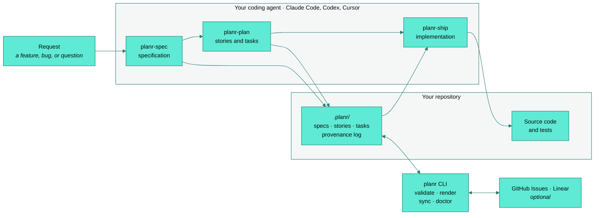
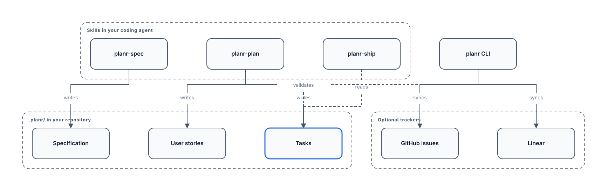
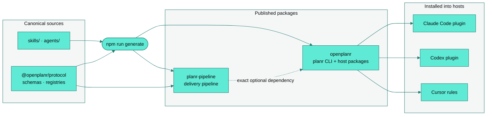

<p align="center">
  <picture>
    <source media="(prefers-color-scheme: dark)" srcset="docs/assets/brand/openplanr-lockup-on-dark.png">
    
  </picture>
</p>

<h3 align="center">Close the loop from intent to delivery.</h3>

<p align="center">
  OpenPlanr is the shared delivery loop for product teams and their AI agents.<br>
  Plan, design, build, review, and operate from durable context in your repository:<br>
  27 skills for Claude Code, Codex, and Cursor, plus the deterministic <code>planr</code> CLI.
</p>

<p align="center">
  <a href="https://www.npmjs.com/package/openplanr"></a>
  <a href="https://www.npmjs.com/package/openplanr"></a>
  <a href="https://github.com/openplanr/OpenPlanr/actions/workflows/ci.yml"></a>
  <a href="packages/cli/package.json"></a>
  <a href="LICENSE"></a>
</p>

<p align="center">
  <a href="docs/getting-started.md">Getting started</a> ·
  <a href="docs/generated/skills.md">Skills</a> ·
  <a href="packages/cli/docs/CLI.md">CLI reference</a> ·
  <a href="docs/architecture/README.md">Architecture</a> ·
  <a href="SUPPORT.md">Support</a>
</p>

---

## What it is

- **Skills, not a second model.** Every skill runs inside the coding agent you already use.
  OpenPlanr adds no model calls, API keys, or telemetry.
- **Plans are files.** Specifications, user stories, tasks, and provenance live under `.planr/`
  in your repository, reviewed and versioned like code.
- **A deterministic CLI.** `planr` stores and validates planning files, renders diagrams and
  reports, installs the skills into each host, diagnoses installations, and syncs with GitHub
  Issues and Linear.
- **One repository, MIT licensed.** Three npm packages: [`openplanr`](packages/cli) (the CLI and
  host packages), [`planr-pipeline`](packages/pipeline) (the delivery pipeline), and
  [`@openplanr/protocol`](packages/protocol) (schemas and registries).

OpenPlanr is not a hosted project tracker and does not replace your issue tracker. It closes the
loop: the agent reads the plan before it changes code, and what it ships flows back as evidence
for the next review.

## Quick start

```bash
npm install -g openplanr

planr setup --runtime claude --scope user
# Codex:  planr setup --runtime codex --scope user --skill-mode unified-plugin
# Cursor: planr setup --runtime cursor --scope project
cd your-project
planr init
```

Restart the coding agent so it loads the new skills, then start with a specification:

```text
/planr:spec "Add passwordless sign-in for existing accounts"     # Claude Code
$planr:spec "Add passwordless sign-in for existing accounts"     # Codex
```

In Cursor, mention the `planr-spec` rule in Composer. Follow with `plan` to decompose the
specification into stories and tasks, and `ship` to implement one task. Plan and ship stay
separate steps that you invoke.

Alternatives: `npx openplanr@latest setup` without a global install, or
`curl -fsSL https://openplanr.dev/install.sh | sh` (`irm https://openplanr.dev/install.ps1 | iex`
on Windows). OpenPlanr requires Node.js 20 or later. The
[getting started guide](docs/getting-started.md) covers scopes, what setup writes, and how to
undo it.

## How it works



Reasoning stays in the host agent. The CLI never calls a model; it validates what the agent
wrote, renders it, and keeps trackers in step.

## Capabilities

Plan. Design. Build. Review. Operate. Every step is a skill the agent selects from its
description, or that you invoke by name.

| Family | Skills | CLI utility the skill may call |
| --- | --- | --- |
| Plan and specify | `spec`, `plan`, `plan-review`, `sprint` | `planr spec`, `planr sprint` |
| Implement | `ship` (dispatches 9 role agents in Claude Code) | — |
| Review and QA | `browser-qa` | — |
| Design | `design`, `design-loop`, `design-review` | `planr artifact` |
| Diagrams | `diagram` | `planr diagram` |
| Artifact reviews | `artifact` | `planr artifact` |
| Land and release | `land`, `release` | `planr land` |
| Setup and diagnostics | `doctor`, `investigate` | `planr doctor`, `planr upgrade` |
| Status, routing, and sync | `status`, `sync`, `dashboard`, `openplanr` (routes a request to the best skill) | `planr status`, `planr sync`, `planr dashboard` |
| Operate | `operate` with `ceo`, `cto`, `cpo`, `cmo`, `coo`, `challenger`, and `chair` reviews | `planr operate` |

Invoke a skill as `/planr:<skill>` in Claude Code or `$planr:<skill>` in Codex; in Cursor,
mention the `planr-<skill>` rule. The [skill catalog](docs/generated/skills.md) is generated from
the registry and lists every trigger, deferral, and packaged reference.

## Diagram engine

<p align="center">
  <a href="docs/diagrams/planning-artifacts/planning-artifacts.svg">
    
  </a>
</p>

<p align="center"><sub>Rendered by <code>planr diagram render</code> from
<a href="docs/diagrams/planning-artifacts/planning-artifacts.planr-diagram.json">a canonical document</a>;
verified in CI by <code>planr diagram check</code>. The engine ships one light theme today.</sub></p>

`planr-diagram` turns intent into a canonical semantic document, and the offline engine lays
it out deterministically across 39 grammars (architecture, sequence, ER, Gantt, story map,
Wardley, and more). Every render produces SVG, PNG, accessible HTML, quality and fidelity
reports, and a manifest that binds the set.

```bash
planr diagram gallery                                          # list grammars
planr diagram render ./architecture.planr-diagram.json --json  # render a set
planr diagram check ./diagrams/architecture/architecture.manifest.json --json
```

See [authoring and verifying diagrams](docs/diagrams/authoring.md).

## Hosts

| Host | Install | Invoke | Notes |
| --- | --- | --- | --- |
| Claude Code | `planr setup --runtime claude --scope user` | `/planr:<skill>` | Unified `planr` plugin; `ship` dispatches 9 role agents |
| Codex | `planr setup --runtime codex --scope user --skill-mode unified-plugin` | `$planr:<skill>` | Unified plugin; `--skill-mode direct` installs bare-named skills instead |
| Cursor | `planr setup --runtime cursor --scope project` | mention the `planr-<skill>` rule | Project rules under `.cursor/rules/` |

`planr rules generate` adds an `## OpenPlanr capabilities` section to `CLAUDE.md` or `AGENTS.md`
so the agent knows every skill and when to reach for it. See the
[host matrix](docs/skills/host-matrix.md) for what each projection may and may not change.

## Architecture



One canonical skill graph is generated into host-native projections; generated files are
outputs, never sources. The CLI composes five command groups (foundation, planning, delivery,
operations, intelligence) over the Protocol contracts, and internal workspaces (`operate`,
`artifact`, `design`, `skill-runtime`, the dashboard) are projected into the public packages at
generation time. See the [architecture guide](docs/architecture/README.md).

## Documentation

**Use**
[Getting started](docs/getting-started.md) ·
[Skill catalog](docs/generated/skills.md) ·
[CLI reference](packages/cli/docs/CLI.md) ·
[Troubleshooting](packages/cli/docs/TROUBLESHOOTING.md) ·
[Diagrams](docs/diagrams/authoring.md)

**Contribute**
[Contributing](CONTRIBUTING.md) ·
[Architecture](docs/architecture/README.md) ·
[Working from a checkout](docs/contributing/dogfooding.md) ·
[Skill authoring](docs/skills/authoring.md) ·
[Releasing](docs/RELEASING.md)

**Integrate**
[Protocol package](packages/protocol/README.md) ·
[Pipeline package](packages/pipeline/README.md) ·
[Host matrix](docs/skills/host-matrix.md) ·
[Skill versioning](docs/skills/versioning-and-impact.md) ·
[Release provenance](docs/PROVENANCE.md)

## Community and license

Ask questions and share what you built in
[Discussions](https://github.com/openplanr/OpenPlanr/discussions); report bugs through the
[issue forms](https://github.com/openplanr/OpenPlanr/issues/new/choose). [SUPPORT.md](SUPPORT.md)
explains what to include. Security reports follow [SECURITY.md](SECURITY.md); participation
follows the [code of conduct](CODE_OF_CONDUCT.md).

OpenPlanr is [MIT licensed](LICENSE). The name and logo are covered by the
[trademark policy](TRADEMARKS.md); the boundary between this repository and the hosted service
is described in [COMMERCIAL.md](COMMERCIAL.md). Maintained by
[Asem Abdo](https://github.com/AsemDevs) and contributors.
