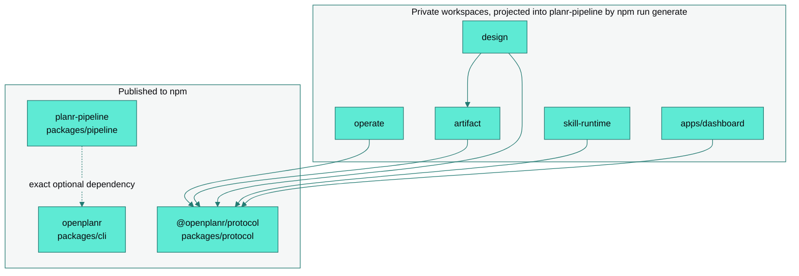

# OpenPlanr architecture

One repository holds every OpenPlanr component. Three workspaces publish to npm;
the rest are private MIT source whose implementations are projected into the public
packages at generation time, so a published tarball never resolves an unpublished
workspace at runtime.

| Workspace | Owns |
| --- | --- |
| `packages/protocol` | Schemas, registries, catalogs, browser-safe contracts, canonical JSON, validation, shared typed errors |
| `packages/pipeline` | The delivery pipeline and self-contained projections of Protocol, Operate, artifact, and design |
| `packages/cli` | The `planr` command, host packages, setup and diagnostics, GitHub and Linear sync, a digest-verified copy of the dashboard |
| `packages/operate`, `packages/artifact`, `packages/design` | Their runtimes, in that dependency order |
| `packages/skill-runtime` | Skill composition and host generation over declarative contribution manifests |
| `packages/integrations` | Portable integration behavior |
| `apps/dashboard` | Browser code for the local planning and Operate dashboard |
| `skills/planr-*`, `agents/{po,dev,qa,post-build}` | Canonical skill sources and role definitions |
| `adapters/`, `conformance/` | Generated host projections; contract verification that runtime code never imports |
| `evaluation/`, `examples/` | Evaluation inputs and Protocol usage examples; runtime and authoring templates stay with their owning package |

## Dependency rules

`scripts/check-workspace-boundaries.mjs` enforces the graph above: runtime code cannot
import `conformance/`, internal packages cannot depend on the CLI, Operate cannot import
runtime implementations, artifact cannot depend back on design, and no public package
may require a private package or a local source path.

`scripts/check-composition-boundaries.mjs` enforces the composition seams. The CLI root
composes five named command groups (foundation, planning, delivery, operations,
intelligence); dashboard composition roots consume explicit runtime and route
registries; pipeline internals expose eight phase and domain facades under
`packages/pipeline/lib/{po,dev,ship,roles,guided,investigate,release,state}/`, with
`lib/domain-ownership.json` as the machine-readable map. Fan-in is bounded and wildcard
barrels are rejected at these boundaries; cohesive leaf modules import what they need.

## Generation graph

`npm run generate` runs the ordered steps in `scripts/generate-all.mjs`: skill and
role host adapters, Protocol catalogs and their pipeline projection, dashboard
contracts, artifact and diagram assets, domain projections, Operate and landing
contracts, dashboard
package assets, and ecosystem marketplace metadata. `npm run check:generated`
replays those steps in check mode and rejects stale output, conflicting writers,
unsafe includes, digest drift, and undeclared package assets. The retired
repository-consolidation catalog is no longer a generation step.

- Edit task-specific behavior only in `skills/planr-*/SKILL.md`; edit reusable policy only
  in a declared file under `skills/shared/`.
- `scripts/skills/generate-v18.mjs` is the sole host-package generator. Canonical skills
  stay under `skills/`; installable packages are emitted to the ignored `dist/plugins/`.
- Treat `packages/pipeline/registry/generated-skill-assets.json` as package custody, not
  an authoring surface.
- Closed registries with historical prompt snapshots are compatibility evidence. They are
  readable but never override the canonical root source.

## Compatibility

The CLI and pipeline distributions keep self-contained compatibility projections, and
package versions stay independent of schema and document versions. `conformance/`
verifies the public contracts without being imported by runtime code. Historical
consolidation inventories remain recoverable through Git; active package and
contract tests verify the supported distribution. [Verifying a release](../PROVENANCE.md) explains how to
check a published version's signature and attestation.

## Service boundary

This repository owns the MIT-licensed portable product. The separately operated hosted
service owns tenant storage, authorization, billing, enterprise administration, and
deployment operations. Public clients and Protocol contracts may describe those
capabilities; every hosted permission is enforced server-side. See
[COMMERCIAL.md](../../COMMERCIAL.md).

## Repository maintenance

The [maintenance decision](repository-maintenance.md) distinguishes canonical
sources, generated distributions, active compatibility contracts, and retired
migration evidence. Generated runtime copies are rebuilt during generation and
packaging; fresh-checkout and isolated-install checks protect the distribution.
